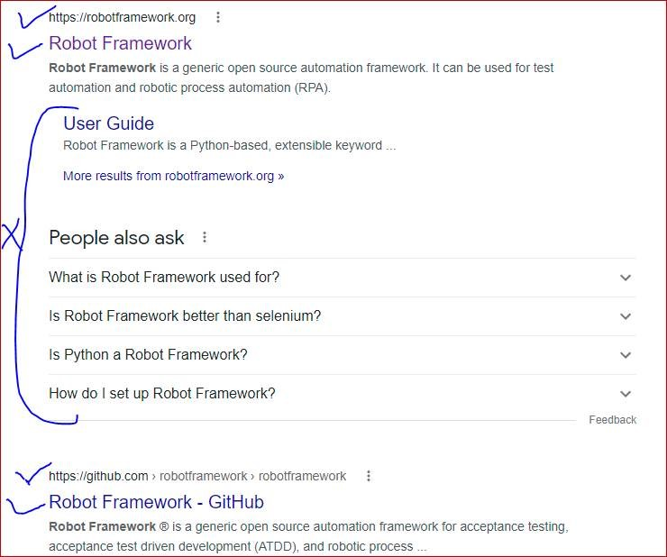

# Robot Framework

## Extracting the links from the google search page

### Steps to Automate

* Write a test case in Robot Framework using Selenium library. Open google.com and search for "robotframework"
* Print links to console as mentioned in below snapshot(only tick marked one) and to a text file

### The below is the screen shot of the expected result

    

### Steps Automated

* Opening Chrome browser and navigating to https://www.google.com/
* Maximizing the browser
* Input 'robotframework' text in edit field of search box
* Press enter key in order to search
* Store elements count in a 'AllLinksCount' variable
* Print the 'AllLinksCount' variable in the console
* Write a for loop to print all the links to the console
* Close the browser

### The below is the screen shot of the console

 
  

### Reports

 
  

    click the <a href="./report.html">reports</a> link for the html reports of the automated test case
    

    

